# MSD Appliances - Full Stack E-Commerce System

A professional Full-Stack E-Commerce application designed for appliance management, featuring a Spring Boot backend and a React (Vite) frontend.

## 🚀 Project Overview
This system allows for product management, user authentication, and order processing. It is built to be lightweight, scalable, and easy to deploy.

------------------------------------------------------------------------------
------------------------------------------------------------------------------
------------------------------------------------------------------------------

## 🛠️ Step-by-Step Implementation Guide

Follow these steps to get the project running on your local machine.

------------------------------------------------------------------------------
### 1. Tech Stack & Versions
------------------------------------------------------------------------------

| Technology      | Version   | Purpose                        |
| :-------------- | :-------- | :----------------------------- |
| **Java** | 17 LTS    | Backend Logic                  |
| **Spring Boot** | 3.x.x     | Application Framework          |
| **Node.js** | 18+       | Frontend Environment           |
| **React** | 18.x      | User Interface (Vite)          |
| **MySQL** | 8.0       | Relational Database            |
| **Cloudinary** | Latest    | Image Hosting & Optimization  |
| **Maven** | 3.9+      | Dependency Management          |

------------------------------------------------------------------------------
### 2. Database Setup
------------------------------------------------------------------------------

* Open your MySQL terminal or Workbench.
* Create a new database:
    ```sql
    CREATE DATABASE ecommerce_db;
    ```
* Update the backend configuration:
    1. Navigate to `backend/src/main/resources/application.properties`
    2. Set the credentials:
       ```properties
       spring.datasource.url=jdbc:mysql://localhost:3306/ecommerce_db
       spring.datasource.username=root
       spring.datasource.password=Your_MySQL_Password_Here
       spring.jpa.hibernate.ddl-auto=update
       spring.jpa.show-sql=true
       ```

------------------------------------------------------------------------------
### 3. ☁️ Cloudinary Setup (For Product Images)
------------------------------------------------------------------------------

To handle images like the iPhone 17 Pro Max or Samsung S26 via the cloud:

* Create a free account at Cloudinary.com.
* Go to your Dashboard and find your credentials.
* Update `backend/src/main/resources/application.properties`:
    ```properties
    cloudinary.cloud_name=your_cloud_name
    cloudinary.api_key=your_api_key
    cloudinary.api_secret=your_api_secret
    ```

------------------------------------------------------------------------------
### 4. Running the Backend (Spring Boot)
------------------------------------------------------------------------------

1. Open Git Bash in the `backend` folder.
2. Run the command:
    ```bash
    ./mvnw clean spring-boot:run
    ```

* **Server URL:** http://localhost:8080
* **Default Admin:** admin@msd.com / admin123 (Initialized via DataLoader.java)

------------------------------------------------------------------------------
### 5. Running the Frontend (React)
------------------------------------------------------------------------------

1. Open a new Git Bash terminal in the `frontend` folder.
2. Install the required packages:
    ```bash
    npm install
    ```
3. Start the development server:
    ```bash
    npm run dev
    ```

* **Website URL:** http://localhost:5173

------------------------------------------------------------------------------
------------------------------------------------------------------------------
------------------------------------------------------------------------------

## 📂 Project Structure

```text
ECOMMERCE-APP/
├── backend/           # Spring Boot Application
│   ├── src/           # Java Source Code
│   └── pom.xml        # Maven Dependencies
├── frontend/          # React Vite Application
│   ├── src/           # React Components & Pages
│   └── package.json   # Node Dependencies
└── .gitignore         # Master Ignore File
```


## 🖼️ Project Gallery
------------------------------------------------------------------------------------------------------------------------------------------------------------
### 🛡️ Admin Security & Entry
------------------------------------------------------------------------------------------------------------------------------------------------------------
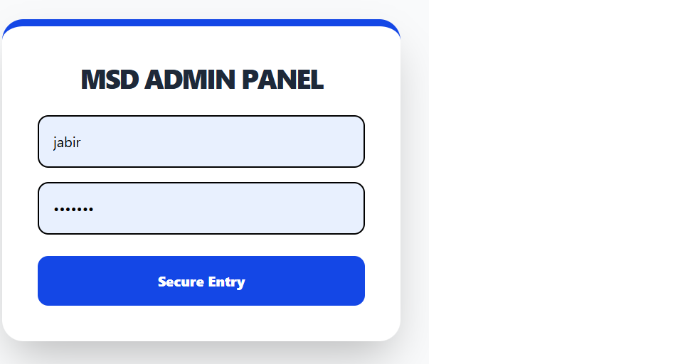
* **Description:** Access to the MSD Appliances management suite is protected by a secure login portal. This ensures that only authorized administrators can modify inventory or view customer order history.
  

------------------------------------------------------------------------------------------------------------------------------------------------------------
### 📦 Inventory & Stock Management
------------------------------------------------------------------------------------------------------------------------------------------------------------
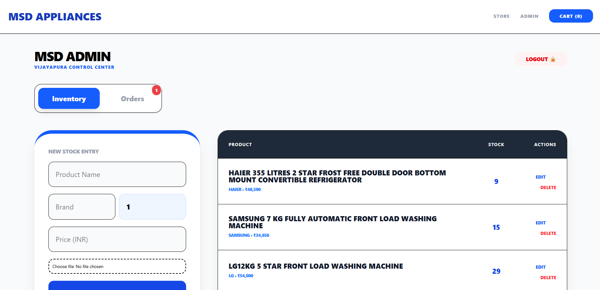
* **Description:** The central dashboard for the Vijayapura Control Center. It displays a real-time list of all appliances currently in stock, including brand details and pricing (e.g., Haier 355L Refrigerator at ₹48,590).

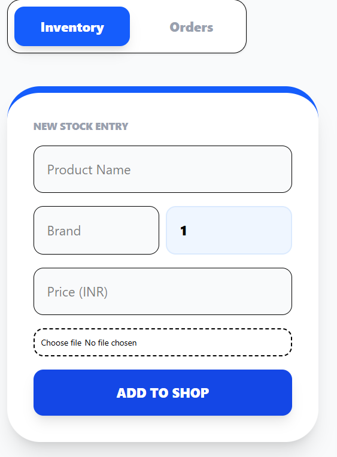
* **Description:** A dedicated interface for managing stock entries. This view allows for quick navigation between current inventory and incoming orders.


------------------------------------------------------------------------------------------------------------------------------------------------------------
### ➕ Adding New Products
------------------------------------------------------------------------------------------------------------------------------------------------------------
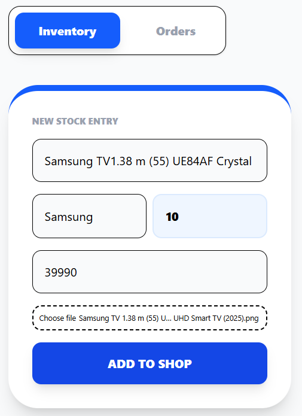
* **Description:** The "New Stock Entry" form allows admins to add products to the shop. It includes fields for Product Name, Brand, Price, and a Cloudinary-integrated file picker for product images.

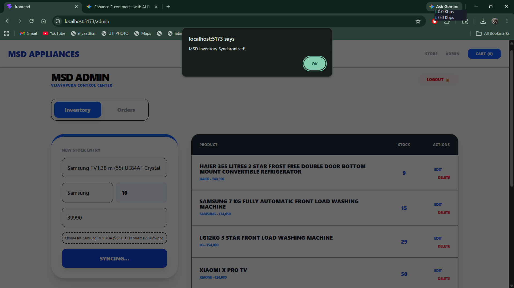
* **Description:** A final confirmation of inventory added successfully.

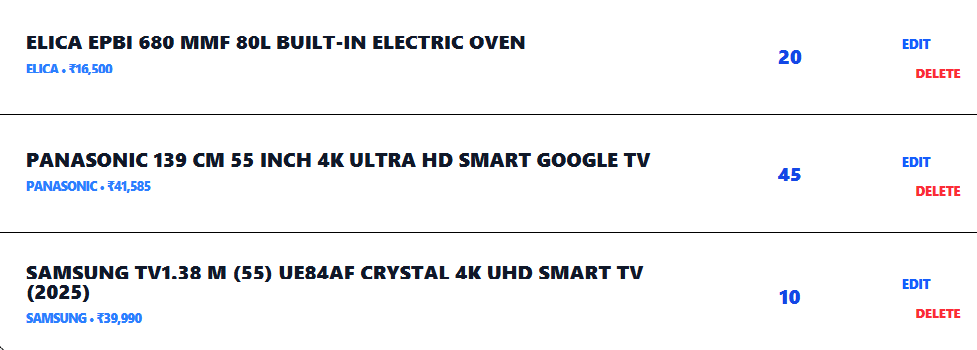
* **Description:** Once a product like the Samsung TV (2025 model) is added, it immediately appears in the master inventory list with options to Edit or Delete the entry.
  

------------------------------------------------------------------------------------------------------------------------------------------------------------
### 🛒 Customer Experience
------------------------------------------------------------------------------------------------------------------------------------------------------------
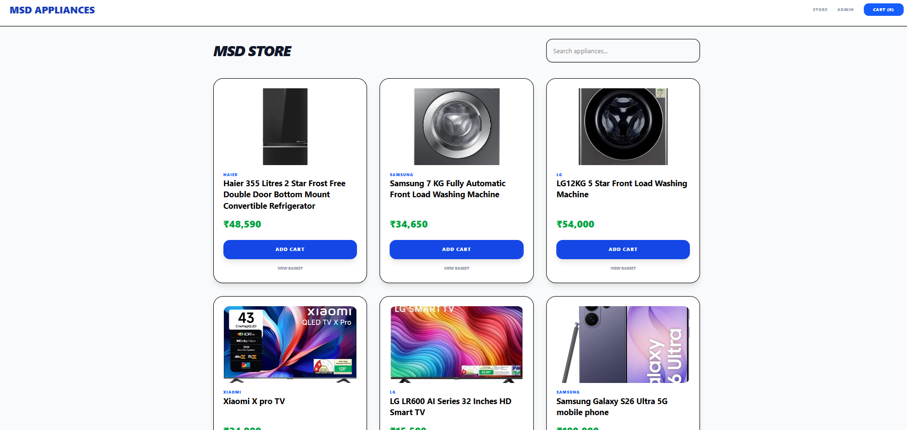
* **Description:** The main landing page for customers, showcasing all available appliances in a clean, responsive grid layout.

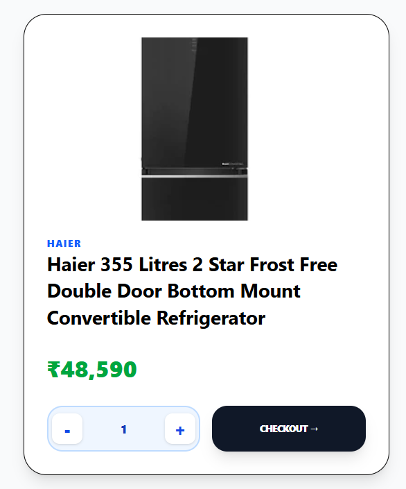
* **Description:** A detailed product card view featuring high-resolution images and clear pricing. Customers can adjust quantities and proceed directly to checkout from this component.
  

------------------------------------------------------------------------------------------------------------------------------------------------------------
### 🛍️ Basket & Delivery Details
------------------------------------------------------------------------------------------------------------------------------------------------------------

* **Description:** The "Your Basket" page displays selected items and calculates the total payable amount in real-time.

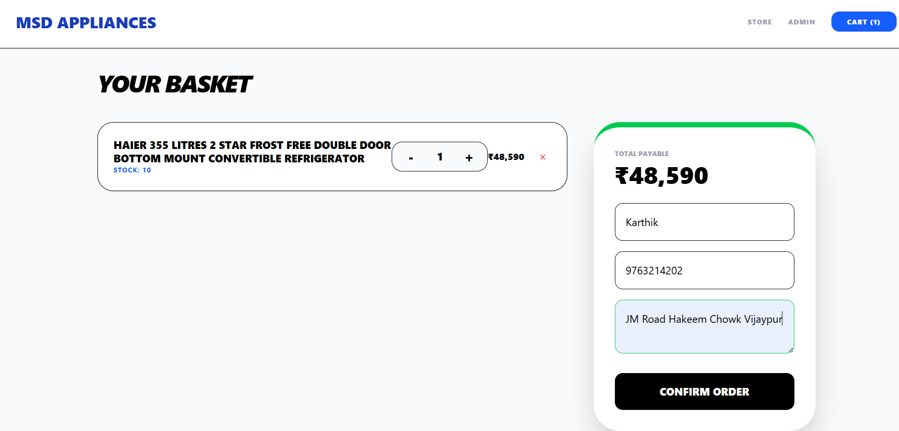
* **Description:** To ensure accurate delivery, this form captures the customer's full name, mobile number, and specific delivery address (e.g., JM Road Hakeem Chowk).
  

------------------------------------------------------------------------------------------------------------------------------------------------------------
### 🧾 Order Fulfillment
------------------------------------------------------------------------------------------------------------------------------------------------------------
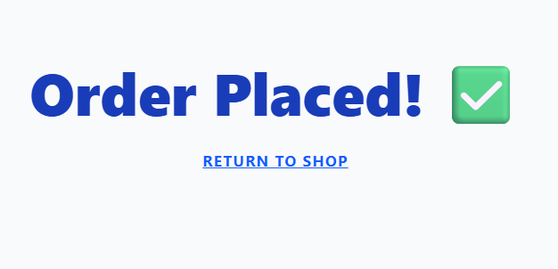
* **Description:** A confirmation screen indicating the order has been successfully transmitted to the MSD Appliances database.

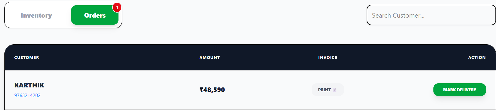
* **Description:** Real-time system notifications alert the admin when a new customer has completed a purchase.

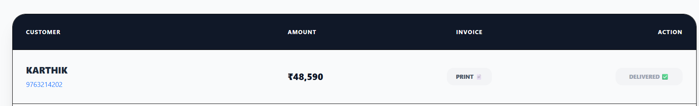
* **Description:** The admin orders tab allows the manager to track fulfillment status and mark items as "Delivered" once the customer has received their appliance.
  

------------------------------------------------------------------------------------------------------------------------------------------------------------
### 📄 Professional Billing
------------------------------------------------------------------------------------------------------------------------------------------------------------
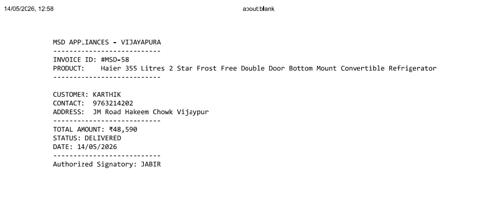
* **Description:** Automatically generates a formal MSD Appliances Invoice (e.g., #MSD-58). The document includes customer contact details, the delivery address, total amount paid, and the signature of the Authorized Signatory: JABIR.


👤 Author
JABIR - Authorized Signatory - MSD Appliances
GitHub: @Jabirhu
Ph: +91 8310426460
